# University Drupal Site — Architecture & Build Guide

A navigable reference for planning and building a major university website in Drupal 11.
Captures the key decisions, workflows, and considerations, with flow diagrams.

## Table of Contents

1. [Build Order (Roadmap)](#1-build-order-roadmap)
2. [Config-as-Code Workflow](#2-config-as-code-workflow)
3. [Multisite vs. Domain Access vs. Separate Installs](#3-multisite-vs-domain-access-vs-separate-installs)
4. [Information Architecture & Content Model](#4-information-architecture--content-model)
5. [People vs. Users](#5-people-vs-users)
6. [Blocks, Regions & Per-Type Layouts](#6-blocks-regions--per-type-layouts)
7. [Theming](#7-theming)
8. [Governance & Editorial Workflow](#8-governance--editorial-workflow)
9. [Accessibility & Compliance](#9-accessibility--compliance)
10. [Authentication & Integrations](#10-authentication--integrations)
11. [Performance, Hosting & Operations](#11-performance-hosting--operations)
12. [AI / Agent-Driven Development](#12-ai--agent-driven-development)
13. [Distributions & Starting Points](#13-distributions--starting-points)
14. [Full Considerations Checklist](#14-full-considerations-checklist)
15. [Decision Log](#15-decision-log)
16. [Sources](#16-sources)

---

## 1. Build Order (Roadmap)

Each layer depends on the one before it. Don't build layouts before fields exist; don't
build fields before the platform/governance model is chosen.

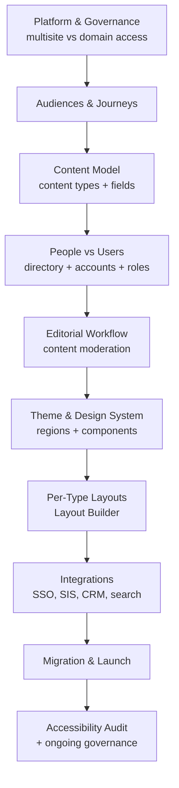

---

## 2. Config-as-Code Workflow

**Core principle:** the database holds *active* config (a working surface); `config/sync`
(in git) is the **single source of truth**. Every change is exported to clean YAML and
reviewed before commit. Never hand-edit config YAML.

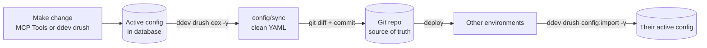

**Commands:**

- `ddev drush cex -y` — export DB active config to `config/sync`
- `ddev drush config:status` — confirm DB and YAML are in sync
- `git diff config/sync` — review before committing
- `ddev drush config:import -y` — apply `config/sync` on another environment

**Watch out for:** Layout Builder per-node overrides (`allow_custom: true`) are stored in
the **database**, not config — they will not be in git. Keep `allow_custom: false` for
pure config-as-code.

---

## 3. Multisite vs. Domain Access vs. Separate Installs

The first and most expensive architectural fork. Driven by how much content, users, and
branding the subdomains share.

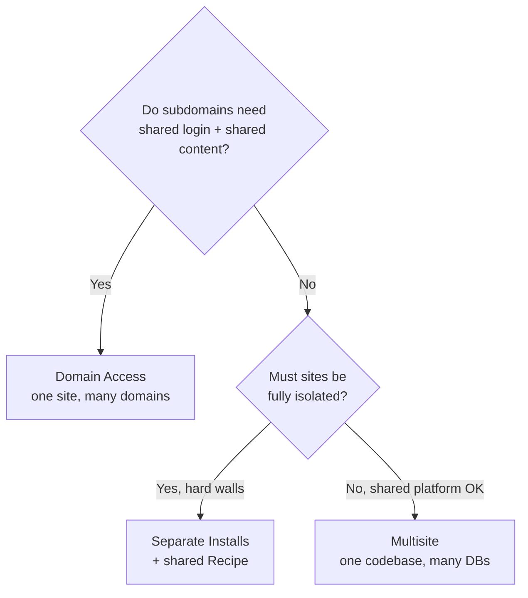

| Need | Multisite | Domain Access | Separate installs |
|---|---|---|---|
| Shared login (SSO) across subdomains | ❌ | ✅ | ❌ |
| Share/syndicate content between sites | ❌ | ✅ | ❌ |
| Full isolation (one can't break another) | ⚠️ shared code | ❌ | ✅ |
| Independent editorial teams | ✅ | ⚠️ via permissions | ✅ |
| One `composer update` for all | ✅ | ✅ | ❌ |
| Per-site config-as-code in git | ✅ per site | ✅ one set | ✅ per repo |
| Effort to add a new subdomain | Low | Lowest | High |

**Recommendation for a single university:** Domain Access is the usual best fit (SSO,
shared content, one config set). Reserve Multisite for genuinely walled-off units; use
separate installs only for fully autonomous properties.

### How a subdomain maps to Drupal

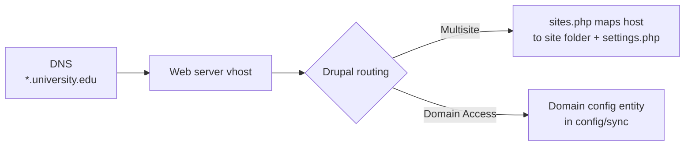

---

## 4. Information Architecture & Content Model

Structured, referenced data over duplication. Define content types first; everything
downstream depends on them.

**Typical university content types:**

- **Page** — flexible marketing/landing pages
- **News / Article** — announcements, press
- **Event** — date/time, location, registration
- **Program / Degree** — the conversion engine for prospective students
- **Department / Unit** — org structure
- **Person / Profile** — faculty & staff directory
- **Course** — catalog entries

**Entity relationships (reference, don't duplicate):**

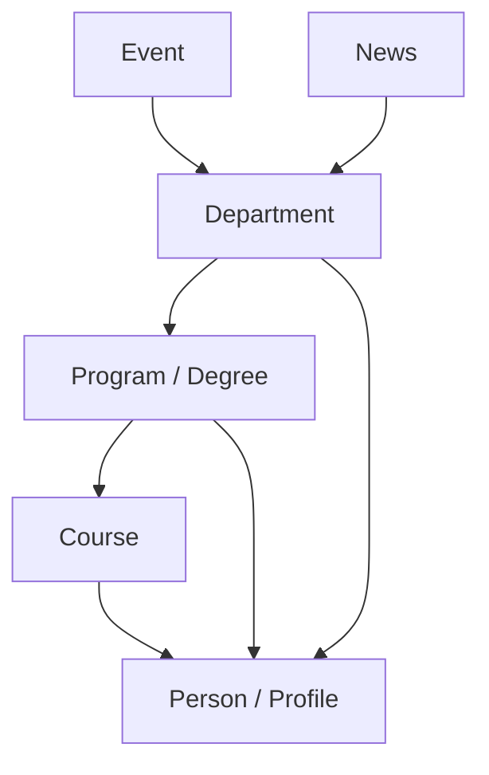

Supporting tools: Pathauto (URLs), Metatag (SEO), Media Library, taxonomy for
subject/audience tagging.

---

## 5. People vs. Users

The single most important Drupal distinction to get right. "People" means two different
things — never conflate them.

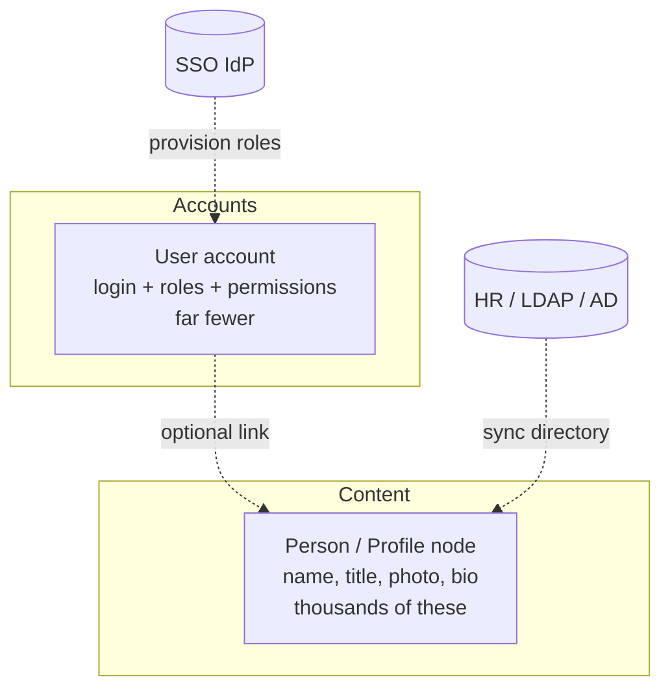

- **Person = content** (public directory entry, no login).
- **User = account** (logs in, carries roles/permissions).
- A directory of 2,000 faculty should **not** be 2,000 user accounts.
- Optionally link a User to its Person node so faculty can edit their own profile.

---

## 6. Blocks, Regions & Per-Type Layouts

### Regions vs. visibility

Regions are fixed by the **theme**, not by content type. The same regions exist on every
page. What varies per content type is **which blocks are visible**, via visibility
conditions — or the whole layout, via Layout Builder.

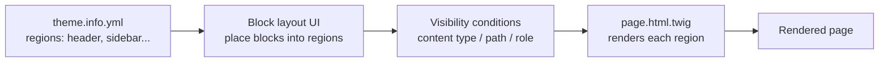

### Two ways to differentiate per content type

- **Same regions, different blocks** → Block layout + Content type visibility condition.
- **Truly different layout/regions per type** → **Layout Builder**, enabled per content
  type at `/admin/structure/types/manage/{type}/display`.

### Layout Builder per content type

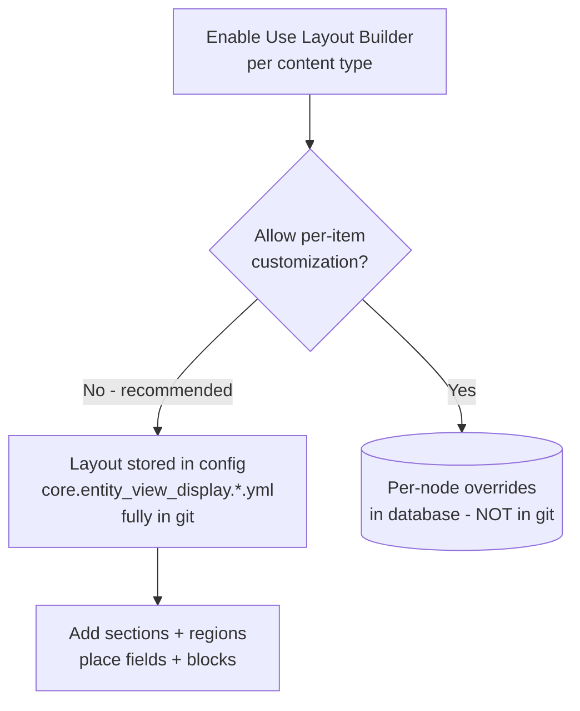

Keep **"Allow each content item to have its layout customized" unchecked** to stay pure
config-as-code (no per-node database data). Each content type's layout lives in its own
`core.entity_view_display.node.<type>.default.yml`.

---

## 7. Theming

A Drupal 11 theme lives in `web/themes/custom/MY_THEME/`.

**Key files:**

- `MY_THEME.info.yml` — declares the theme, base theme, libraries, and **regions** (the
  link to the Block UI)
- `MY_THEME.libraries.yml` — CSS/JS bundles
- `MY_THEME.theme` — PHP preprocess hooks
- `templates/` — Twig overrides
- `components/` — Single Directory Components (D11 design-system unit)

**Scaffold with the Starterkit:**

```bash
ddev exec php web/core/scripts/drupal generate-theme unimark \
  --name="UniMark" --starterkit olivero
ddev drush theme:enable unimark -y
ddev drush config:set system.theme default unimark -y
ddev drush cr && ddev drush cex -y
```

**The region → block chain:**

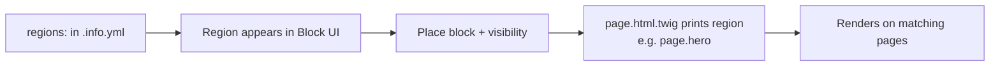

> Block placements are theme-specific config (`block.block.*.yml`, each pinned to a
> theme). Switching default themes requires re-placing blocks. The `content` region is
> mandatory.

---

## 8. Governance & Editorial Workflow

Distributed editing is *the* central university challenge. Decentralization **without**
governance is the documented failure mode (departments publishing conflicting versions of
the same information).

**Pick a governance model — most universities choose hybrid:**

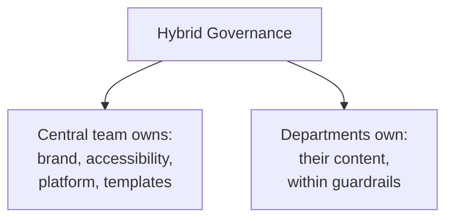

**Content moderation workflow (Content Moderation module — all config, in git):**

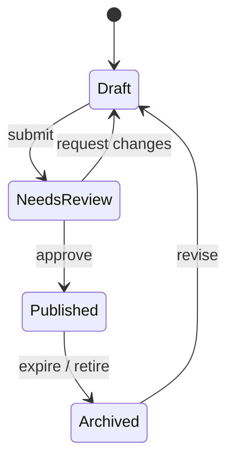

**Governance deliverables (artifacts, not just settings):**

- Brand guidelines + web-writing standards
- Editorial criteria / approval chains
- Role definitions (author, editor, department admin)
- Content review/expiry policy (universities accumulate stale content fast)
- Mandatory editor training: CMS + brand + accessibility

---

## 9. Accessibility & Compliance

High-stakes and legally driven for public universities.

- **Standard:** WCAG 2.1 **Level AA** (adopted by DOJ under ADA Title II).
- **Deadlines (after the DOJ April 2026 extension):**
  - **April 26, 2027** — institutions serving ≥ 50,000 people
  - **April 26, 2028** — smaller institutions
- **Scope:** websites, mobile apps, **digital course materials, student portals/LMS,
  virtual events** — not just the marketing site. Limited exceptions for archived content.
- **Other regimes:** FERPA (student records), GDPR (international/EU prospective students).

**Compliance flow:**

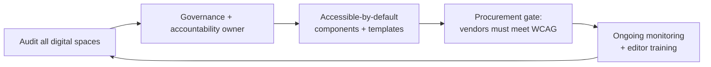

---

## 10. Authentication & Integrations

University sites are integration hubs, not islands.

**Authentication:** SSO is near-mandatory — Shibboleth/SAML, CAS, or Azure AD. Provision
roles automatically from the IdP (faculty/staff/student affiliations). Drupal local login
is rarely used for staff.

**Common integrations:**

- **SIS / course catalog** — Banner, PeopleSoft, Workday Student
- **CRM** — Slate, Salesforce (admissions/recruitment)
- **LMS** — Canvas, Blackboard (links/SSO)
- **Directory** — LDAP / Active Directory (feeds Person profiles)
- **Events** — Localist, 25Live
- **Search** — Search API + Solr/OpenSearch (critical at university scale)
- **Emergency alerts** — campus notification feed

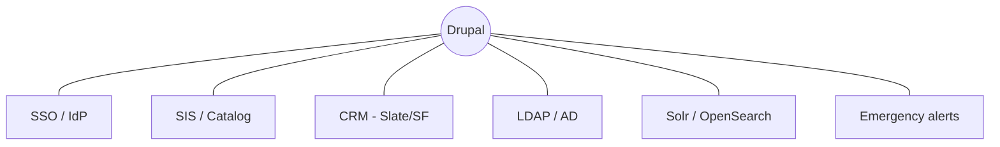

---

## 11. Performance, Hosting & Operations

- **Traffic spikes are predictable:** application deadlines, decision days, athletics,
  emergencies. Plan caching/CDN for surge, not average.
- **Caching layers:** anonymous page cache, dynamic page cache, BigPipe, reverse
  proxy/CDN (Fastly/Cloudflare).
- **Emergency alert banner** must perform under a traffic flood.
- **Hosting:** Acquia / Pantheon (higher-ed-specialized) vs. self-hosted/cloud.
- **Environments:** Dev → Stage → Prod with config-as-code deploys.
- **Security:** patch cadence for core + contrib; least-privilege roles; audit logging.
- **Migration:** legacy sites via Migrate API (often the largest hidden cost) + redirects
  for old URLs.

---

## 12. AI / Agent-Driven Development

Drive site-building through an agent, ending in clean YAML config (see also
`.claude/CLAUDE.md`).

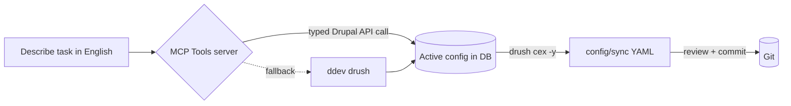

- **MCP Tools** (`drupal/mcp_tools`) — exposes 222 typed tools to Claude/Cursor over MCP.
  Install: `ddev composer require drupal/mcp_tools` → `ddev drush en mcp_tools mcp_tools_stdio -y`.
  Beta as of early 2026; not yet under Drupal's security advisory policy — local dev first.
- **Fallback:** Claude Code driving `ddev drush` directly already forms a working loop.
- **Always export:** every change ends with `ddev drush cex -y` so git stays clean.

---

## 13. Distributions & Starting Points

> **Reality check (verified June 2026):** the era of free, community-maintained higher-ed
> *distributions* has largely faded. Most dedicated distros are abandoned. The current,
> recommended path is **build-your-own with Recipes** — not adopting a monolithic distro.

**Status of the named higher-ed distributions:**

| Project | Status | Notes |
|---------|--------|-------|
| **OpenEDU** | ❌ Abandoned | Last release **8.x-3.3, Dec 2018**; Drupal 8 (EOL Nov 2021). Do not use. |
| **OpenAcademy** | ❌ Dead | Drupal 7 (EOL Jan 2025). |
| **OpenScholar** | ⚠️ Sunset | D7 unmaintained; hosted service only. |
| **EDU Accelerator (OHO Interactive)** | 💲 Vendor product | Claims D11 + quarterly updates. **Commercial agency offering**, not a free drupal.org contrib project — verify terms directly. |
| **Provus®EDU (Promet Source)** | 💲 Vendor product | Another commercial D11 higher-ed distro. Verify directly. |

**Recommended approach — Recipes, not distributions.** Drupal 11's **Recipe** system lets
you compose your content model, governance, and accessibility config as versioned,
reusable units in *your own* repo. This fits the config-as-code workflow far better than
inheriting an abandoned distro, and gives repeatable provisioning of new department sites.

> Treat any distribution/accelerator (including vendor ones) as **reference for the
> content model and integrations** — then encode the parts you want as your own Recipe.
> Always re-verify a project's release date and core-version support before adopting; this
> landscape churns.

---

## 14. Full Considerations Checklist

- [ ] **Platform strategy** — multisite vs. Domain Access vs. separate installs
- [ ] **Governance model** — centralized / decentralized / hybrid (likely hybrid)
- [ ] **Subsite lifecycle** — how new sites are provisioned and retired
- [ ] **Audiences & journeys** mapped (prospective, current, faculty, alumni, donors...)
- [ ] **Content model** — content types + fields, referenced not duplicated
- [ ] **People vs. Users** split; directory sourcing (LDAP/HR sync)
- [ ] **SSO** — Shibboleth/SAML/CAS/Azure AD; role provisioning
- [ ] **Editorial workflow** — Content Moderation; approval chains
- [ ] **Roles & permissions** — least privilege, per department
- [ ] **Accessibility** — WCAG 2.1 AA target; April 2027 deadline; procurement gate
- [ ] **Legal** — FERPA, GDPR as applicable
- [ ] **Branding / design system** — components within brand guardrails
- [ ] **Per-type layouts** — Layout Builder, `allow_custom: false`
- [ ] **Search** — Search API + Solr/OpenSearch
- [ ] **Integrations** — SIS, CRM, LMS, events, alerts
- [ ] **Performance** — caching + CDN for surge traffic
- [ ] **Hosting & environments** — Dev/Stage/Prod, config-as-code deploys
- [ ] **Migration** — Migrate API + redirects
- [ ] **Security** — patch cadence, audit logging
- [ ] **Multilingual** — decide early if needed
- [ ] **SEO & privacy** — Pathauto, Metatag, sitemaps, cookie consent
- [ ] **Editor training** — recurring workstream
- [ ] **Distribution evaluation** — Drupal EDU Accelerator vs. custom + Recipe

---

## 15. Decision Log

Record each architectural choice as it's made.

| Date | Decision | Options considered | Choice & rationale | Owner |
|------|----------|--------------------|--------------------|-------|
| _TBD_ | Platform strategy | Multisite / Domain Access / Separate | _pending_ | |
| _TBD_ | Governance model | Central / Decentralized / Hybrid | _pending_ | |
| _TBD_ | Distribution | EDU Accelerator / Custom + Recipe | _pending_ | |
| _TBD_ | SSO provider | Shibboleth / CAS / Azure AD | _pending_ | |
| _TBD_ | Hosting | Acquia / Pantheon / Self-hosted | _pending_ | |

---

## 16. Sources

- [Top Drupal Distributions for Higher Education — OHO](https://www.oho.com/blog/top-drupal-distributions-solutions-higher-education)
- [Drupal for Higher Education — Drupal.org](https://new.drupal.org/industries/education)
- [Guide to the ADA Title II Accessibility Rule — EdTech Magazine](https://edtechmagazine.com/higher/article/2025/06/guide-ada-title-ii-accessibility-rule-perfcon)
- [ADA Compliance in Higher Education: 2026 Guide — Level Access](https://www.levelaccess.com/blog/ada-compliance-in-higher-education/)
- [Higher Ed's Guide to Web Governance — Ologie](https://ologie.com/full-circle/2024/10/higher-eds-guide-to-web-governance/)
- [What Is Web Governance on Higher Education Websites — Hannon Hill](https://www.hannonhill.com/blog/2024/what-is-web-governance-on-higher-education-websites-and-how-to-implement-it.html)
- [Content Governance and Workflows for Higher Education — ImageX](https://imagexmedia.com/blog/higher-education-content-governance)
- [Higher Ed Web Governance Best Practices — Modern Campus](https://moderncampus.com/blog/website-governance-best-practices.html)
- [MCP Tools — Drupal.org](https://www.drupal.org/project/mcp_tools)
- [AI tools and projects in the Drupal ecosystem — Drupal.org](https://www.drupal.org/docs/develop/development-tools/ai-coding-tools-for-drupal-development/ai-tools-and-projects-in-the-drupal-ecosystem)
