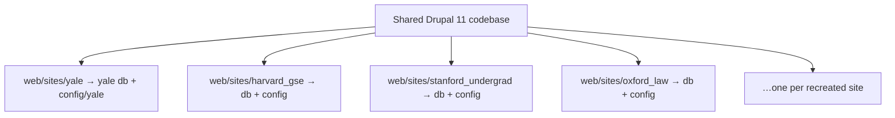
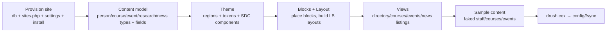

# University Design Catalog — Plan

A **local, browsable catalog** that recreates many "very nice" university Drupal sites (and
their varied **subdomains**) as real Drupal 11 configuration — **regions, blocks, fields,
content types, views, components, elements, styles, and the little details** — so they can be
navigated and compared as a working reference, then used to inform the Tulane build.

> **Scope & disposability:** everything is **local-only and throwaway** — it never leaves this
> machine and gets deleted after review. So there are **no IP/copyright constraints**, and we
> optimize for **fidelity and breadth**, not production cleanliness. (Minor variance from the
> originals is fine and expected.)

## Architecture decision: multisite (one Drupal site per university/subdomain)

**Chosen: Drupal multisite** — each recreated site is its own isolated install under
`web/sites/<key>/`, with its own database, theme, regions, blocks, **fields, content types,
views, taxonomy, menus** — a complete, faithful rebuild.

**Why multisite over one-site-many-themes:** themes can isolate *regions, block placement, and
styles*, but **fields, content types, and Views are site-global**. Because we want to recreate
each university's *whole* information architecture (staff/courses/events/research page types,
each with their own fields and listing views), we need per-site isolation. The usual multisite
downside (config splinters into N dirs, complicating a single deploy) **doesn't apply** — this
is a throwaway local catalog, not a deploy target.

**Browsing the catalog:** each site is its own hostname — `yale.ddev.site`,
`harvard-gse.ddev.site`, `stanford.ddev.site`, … Navigate by switching hostname. A simple
index page (or this doc) lists them.

## Page types to recreate per site

Each site recreates the standard university page set (content types + fields + listing views
+ individual detail pages), not just the homepage:

| Page type | Drupal shape |
|-----------|--------------|
| **Homepage / landing** | Layout Builder page with the site's hero + components |
| **Staff / faculty directory** | `person` content type (name, title, photo, dept, bio, email…) + a directory **View** (filters/facets) + individual profile pages |
| **Courses** | `course` content type (code, title, credits, description, term) + course-listing **View** |
| **Individual class pages** | `course` detail display (syllabus, instructor ref, schedule) |
| **Events** | `event` content type (smart date, location, registration) + events **View** (upcoming) |
| **Research** | `research` / `project` content type (abstract, people, areas) + research listing |
| **News / articles** | `news` content type + news **View** + article detail |
| **Program / department** | `program` / `department` content type + landing |
| **Generic page** | basic `page` for misc content |

These are largely **reusable across universities** (every school has staff/courses/events) —
the per-site variation is mostly **theme, regions, block layout, components, and styling
details**. So the content model is a shared template; the *design* is what we vary per site.

## What "faithful recreation" includes

For each site, capture and rebuild:
- **Regions** — the theme's region map (header, nav, hero, sidebars, footer zones).
- **Blocks** — what's placed where (nav, search, branding, menus, CTAs, feeds), incl.
  visibility.
- **Layout** — homepage + content-type layouts (Layout Builder / paragraphs).
- **Components / elements** — header, hero, cards, callouts, tiles, accordions, tabs,
  facts-and-figures, pull-quotes, footers, buttons, eyebrows, etc.
- **Fields** — the content model per type (the structured data behind each page).
- **Views** — directories, course/event/news listings, with their exposed filters.
- **Styles & details** — color tokens, typography (families/weights/scale), spacing, radii,
  shadows, motion (scroll/hover), the small touches that make each site feel distinct.

(Data for many of these is already captured under [research/](research/): Yale's exact tokens
+ component contracts, computed-style/scroll captures, fingerprints, etc.)

## Candidate sites — chosen for DESIGN VARIETY (incl. subdomains)

To make the catalog comprehensive, recreate a **varied** set — different themes, Drupal
versions, layout systems, and eras. From the fingerprint research, the distinct designs worth
recreating (each is a different theme = different design language):

### Tier 1 — distinct flagship/platform designs
| Site | Theme | Notable |
|------|-------|---------|
| Yale (yalesites) | `atomic` | Emulsify component system, Layout Builder, named color themes |
| Harvard College | `harvard_college` | D11, animated shrink/hide-reveal header, GT America/Canela |
| Stanford Undergrad | jumpstart / Layout Paragraphs | paragraph-nested layouts, distinct from LB |
| CU Boulder | `boulder_base` | open-source platform, inline-block Layout Builder |
| Arizona | `az_barrio` | Bootstrap-based open theme + arizona-profile |
| Princeton | `hobbes` | Acquia, distinct editorial design |

### Tier 2 — subdomain variety within institutions (different teams = different designs)
| Subdomain | Theme | Why it adds variety |
|-----------|-------|---------------------|
| Yale Law (`law.yale.edu`) | `yls_main` | different from yalesites `atomic` — same uni, distinct design |
| Yale Medicine | — | another Yale variant (Typekit, Siteimprove) |
| Harvard GSE | `harvardgse` | self-hosted, different from Harvard College |
| Harvard SEAS | `seas` | Pantheon, distinct again |
| Stanford GSB | `gsb` | Drupal 8 + Layout Builder — older era design |
| Oxford Chemistry | `oxtheme` | Drupal 7 — legacy design era |
| Oxford Law | `olamalu_o` | D11, Olamalu platform |
| Oxford Physics | `physics` | D10, department design |
| Ohio State ETS | `osu_kinetic` | "Kinetic" distribution |
| Brown | `brown` | Typekit, distinct |
| Penn | `penn_global` | D11 |
| Rutgers | `rutgers_edu` | D10, Qualtrics |

> **Subdomains are the variety engine.** A single university spans multiple independent
> designs (Yale: `atomic` vs `yls_main`; Harvard: `harvardgse` vs `seas` vs `harvard_college`;
> Oxford depts span D7/D10/D11). Recreating a spread of these gives the catalog far more range
> than flagship homepages alone.

### Expanding the survey (to be run)
The catalog should keep growing. Method to find more varied subdomains:
- Run the harvester / fingerprint sweep across more department subdomains per institution
  (the `_sweep` tooling already does this — extend the URL lists).
- Prioritize sites with **distinct themes** (new theme name = new design to recreate).
- Note **layout system** (Layout Builder vs Layout Paragraphs vs blocks) and **era** (D7→D11)
  to ensure the catalog spans approaches, not just one style.

## Repeatable per-site build pattern

To keep "many sites" tractable, each site follows the same pipeline (scriptable):

- **Provisioning** is scripted (create DB, hostname, settings, `drush site:install`) so adding
  a site is one command.
- **Content model** (types/fields/views) is a shared template applied per site, then themed.
- **Theme** carries the per-university design (regions, Tailwind/CSS tokens, components).
- **Config** exports to a per-site `config/<site>/sync` so each recreation is inspectable as
  YAML (the catalog's "source" you can read and reuse).

## Driving the build: MCP + Drush (config-as-code)

Per the project [CLAUDE.md](../.claude/CLAUDE.md): build through **MCP Tools** where possible,
**`ddev drush`** fallback; every change exports to the site's config dir. Themes are code
(files in `web/themes/custom/`); content model/blocks/views/layouts are config (exported YAML).

## Pilot: Yale — ✅ WORKING (built on the default site via MCP)

The pilot was built on the **default site** (MCP connects there) to prove the full pipeline
end-to-end. It renders live at `https://drupal.ddev.site/` (Yale-blue header, serif logo,
working nav, faculty directory, dark footer — screenshot:
[research/_catalog/yale-recreation-home-directory.jpg](research/_catalog/yale-recreation-home-directory.jpg)).

**Built entirely via MCP Tools:**
- 5 content types + fields — `person` (directory), `course`, `event`, `research`, `news`.
- 7 sample content items.
- 4 listing Views with pages — `/directory`, `/news`, `/events`, `/courses`.
- Custom **Yale theme** (`web/themes/custom/yale/`) — regions + exact Yale tokens
  (`--yale-blue:#00356b`, gold, serif/sans, spacing) + component CSS (header, hero, callout,
  cards, facts, footer) + `page.html.twig`.
- Nav menu, front page, blocks; **config exported** (117 files in `config/sync`).

### Learnings (fed into the repeatable pattern)
- **MCP works great for content model/content/views** (structure, fields, content, views,
  menus — all created cleanly, in parallel).
- **Theme-specific MCP ops (theme enable, block placement) hit a stale-cache wall** because the
  MCP stdio server boots once and doesn't see a theme created mid-session → used the sanctioned
  **drush fallback** for theme enable + block placement. *Fix for future sites: create the
  theme files BEFORE the MCP session boots, or reconnect MCP after adding the theme.*
- **`mcp_create_content_list_view` with custom `fields` throws** a views render TypeError
  (`array + null`); **title-only views render fine.** Build listings title-only, then theme the
  output (or add fields via drush) for richer displays.
- New content defaults to **unpublished** even with `status:true` — publish after creating.

### Fidelity status
Recognizably Yale (color, type, structure, regions, content model, browsable page set). Not yet
high-fidelity: the listing Views render as plain Drupal lists, not the `.yale-card` grids/hero
the CSS defines. **Next fidelity pass:** theme the View output as card grids + build a Layout
Builder homepage using the hero/callout/facts components.

## Scaling to the rest (multisite)

With the pattern proven, additional universities become subsites:
1. `web/sites/<uni>/settings.php` + DB + `drush site:install` (scriptable).
2. Add an MCP server entry per site (`--uri=<uni>.ddev.site`) in `.mcp.json`; reconnect once so
   all per-site tools load (`mcp__<uni>__*`).
3. Replay the content-model template + that university's theme/tokens/components.
4. Export to `config/<uni>/sync`.
(The `yale` hostname + DB are already created for moving Yale into its own subsite if desired.)

## Honest scope note

This is a **large** effort: recreating homepage + staff directory + courses + class pages +
events + research + news, faithfully, per site, across many sites. The plan de-risks it by
(1) building **Yale fully as the reference template**, (2) making provisioning + the content
model **reusable**, so each additional site is mostly **theme + design details** on top of a
shared structure. Effort will be calibrated after the Yale pilot. Fidelity target: "clearly
recognizable as that university's design," not pixel-perfect.

## Related
- [research/](research/) — the captured intelligence (tokens, components, fingerprints,
  interaction, per-site profiles) that feeds the recreations.
- [research/EXECUTIVE-SUMMARY.md](research/EXECUTIVE-SUMMARY.md) — the synthesis.
- [tools/harvester/](../tools/harvester/) — the Playwright profiler used to capture designs.
