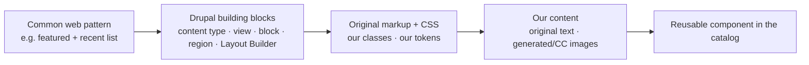
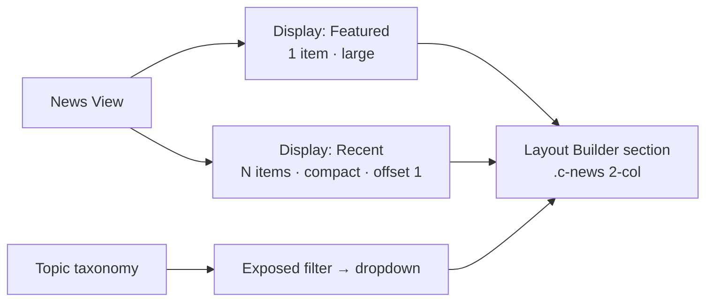
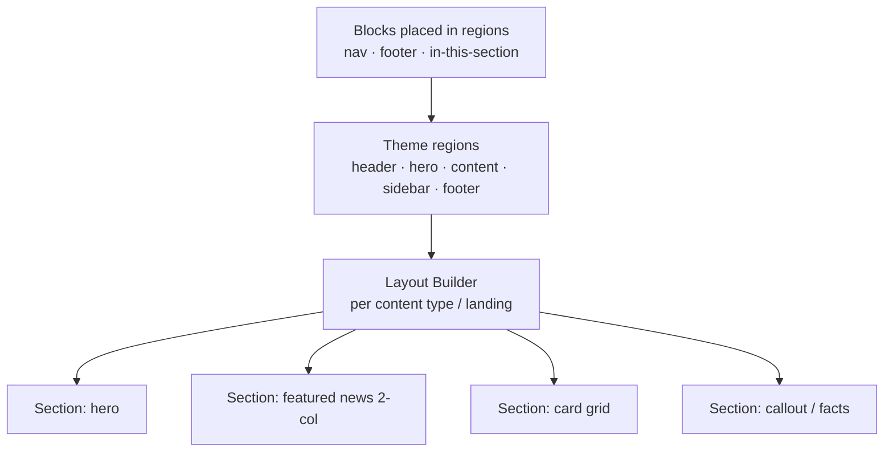

# Building Common Web Patterns as Original Drupal Components

A practical playbook for implementing the **standard, ubiquitous web/UX patterns** that
university and marketing sites use — built **originally** (our own class names, design tokens,
markup, and Creative-Commons / generated images and text), as real Drupal configuration
(content types, fields, views, blocks, regions, Layout Builder).

## Principle: generic pattern → original implementation

Every pattern below is a **common, non-proprietary layout idea** (a hero, a card grid, a
"featured + recent" list). We take the *pattern* and write our own implementation:
- **Our own class names** (a small BEM-ish convention, e.g. `.c-hero`, `.c-news-feature`).
- **Our own design tokens** (palette, type scale, spacing) — not anyone's brand.
- **Our own content** — original copy, **generated avatars (DiceBear)**, **CC/Picsum imagery**.
- **Real Drupal plumbing** — so it's navigable and reusable, not a static mockup.

## The token foundation (own design system)

Define these once in the theme (`css/tokens.css` or `tailwind.config.js`) and every component
reads them — this is what makes the set cohesive and reskinnable:
- **Color:** primitives → semantic roles (`--color-bg`, `--color-text`, `--color-accent`,
  `--color-cta`) → optional named themes for sub-brands.
- **Type:** a display family + a text family; a size scale (xl→xs); weights (e.g. 400/600/700).
- **Spacing:** a numbered scale + semantic aliases (`--space-section`, `--space-inner`, gutter).
- **Breakpoints, radii, shadows, motion** (reduced-motion aware).

(See `docs/research/yalesites/design-tokens.md` for the *structure* of a mature token system —
we use the structure with our **own values**.)

## Pattern library

Each entry: the generic pattern, the Drupal build, and the original styling approach.

### 1. Split hero
**Pattern:** a full-width band split into a text panel (eyebrow · headline · subhead · 1–2
CTAs) and an image area.
**Drupal:** a custom block (or Layout Builder section) placed in a `hero` region, front-page
visibility. Image via a generated/CC file.
**Markup/CSS (ours):** `.c-hero` grid (2 cols → 1 on mobile); `.c-hero__panel`, `.c-hero__media`,
`.c-btn--solid`/`--ghost`. Tokens for color/space/type.

### 2. Featured + recent news  *(the section you asked about)*
**Pattern (generic, everywhere):** a section heading + a topic filter, then **one large
featured story** (image · headline · date) beside a **stacked list of compact headline+date
items**.
**Drupal:**
- `news` content type (title, date, image, body, optional `topic` taxonomy reference).
- A **News View** with two displays:
  - *Featured block* — 1 item, sorted newest, rendered large (image + title + date).
  - *Recent list block* — next N items, compact (title + date), offset by 1.
- A **topic filter** = an exposed filter on the `topic` taxonomy → renders as the `<select>`
  dropdown. (Or a simple menu of topic links.)
- Place both blocks in a Layout Builder section (2-col: feature left, list right).
**Markup/CSS (ours):** `.c-news` wrapper; `.c-news__feature` (figure + title + time);
`.c-news__list` of `.c-news__item` (title + time); `.c-news__filter` for the select + button.
Original class names, our tokens.

### 3. Card grid (news / programs / directory)
**Pattern:** responsive grid of cards (image · eyebrow · title · meta).
**Drupal:** a View (or entity reference list) rendering a card view mode of the content type.
**CSS (ours):** `.c-cards` = `display:grid; grid-template-columns: repeat(auto-fill,minmax(260px,1fr))`;
`.c-card` with media + body; hover-rise.

### 4. People / faculty directory (filterable)
**Pattern:** searchable/filterable grid of person cards (photo · name · role · dept) → profile pages.
**Drupal:** `person` content type (name, role, dept, photo, email, bio); a directory View with
exposed filters (department, search); person card view mode; profile = the full node display.
**Images:** DiceBear-generated avatars on `field_photo`.

### 5. Callout / CTA band
**Pattern:** a colored full-width band with eyebrow · heading · text · button.
**Drupal:** custom block in a section/region. **CSS:** `.c-callout` themed via tokens.

### 6. Facts & figures (stats band)
**Pattern:** a row of big numbers + labels.
**Drupal:** custom block (or a paragraph type `fact` with stat+label, multi-value).
**CSS:** `.c-facts` grid; `.c-fact__stat` large display type.

### 7. Accordion (FAQ) & 8. Tabs
**Pattern:** disclosure list / tabbed panels.
**Drupal:** paragraph types (`accordion` with items; `tabs` with label+content).
**CSS/JS (ours):** native `
`/ARIA tablist; keyboard + reduced-motion. ~30 lines vanilla JS.

### 9. In-this-section secondary nav
**Pattern:** sidebar/section menu of the current area.
**Drupal:** a menu block scoped to the active trail, placed in a `sidebar` region.

### 10. Multi-column footer
**Pattern:** columns of links + utility row.
**Drupal:** menu blocks in `footer_top`; a utility/copyright block in `footer_bottom`.

### 11. Header + primary nav (sticky optional)
**Pattern:** logo + horizontal nav (+ search); optional sticky/shrink on scroll.
**Drupal:** branding + main-menu blocks in `header`. **JS (ours):** optional hide-on-down /
reveal-on-up via a scroll-direction class + CSS transition (reduced-motion aware).

## Page composition (regions · blocks · Layout Builder)

- **Regions** (in `THEME.info.yml`) host site-wide blocks (nav, footer, hero, sidebar).
- **Layout Builder** composes landing/content pages from the component sections above (each a
  block or view block), exported to `config/sync`.

## Image & content strategy (original / CC / generated)
- **Avatars / people:** DiceBear (`api.dicebear.com`) — generated, deterministic, MIT.
- **Scenery / news / hero:** Picsum (`picsum.photos`) for CC-style placeholders, or generated
  SVG gradients/patterns; swap for a real image-gen API if available.
- **Attach in Drupal:** download → `file.repository` writeData → set `field_photo`/`field_image`
  (see the image pass in the build scripts).
- **Text:** original copy generated per content type (faculty bios, news summaries, course
  descriptions). No copied copy.

## How this serves the goals
- **The catalog:** each pattern becomes a real, navigable Drupal component — you browse and
  compare *how the patterns are built*, which is the catalog's purpose.
- **Tulane:** these original components are directly reusable — adopt the patterns, drop in
  Tulane's real tokens/content. An original pattern library beats any single-site clone.

## Build order (per theme)
1. Tokens (palette/type/spacing) → 2. Header/footer/nav → 3. Hero → 4. Card grid +
directory → 5. Featured-news view → 6. Callout/facts → 7. Accordion/tabs → 8. Layout Builder
landing → 9. Generated/CC images + original copy → 10. `drush cex`.

## Related
- `docs/design-catalog.md` — the catalog plan + architecture.
- `docs/research/` — documented token *structures* and component *taxonomies* (patterns), used
  with our own values.
