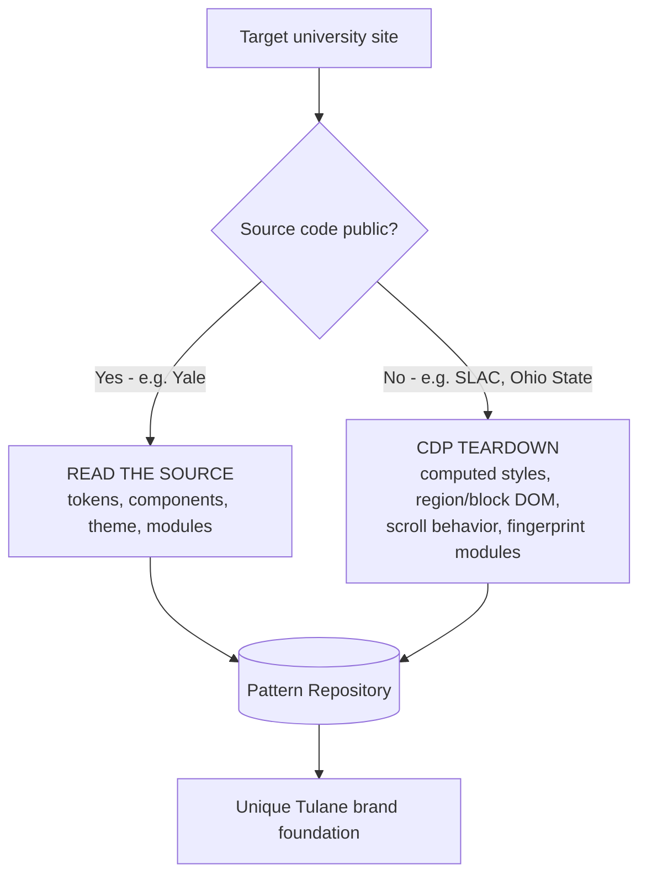
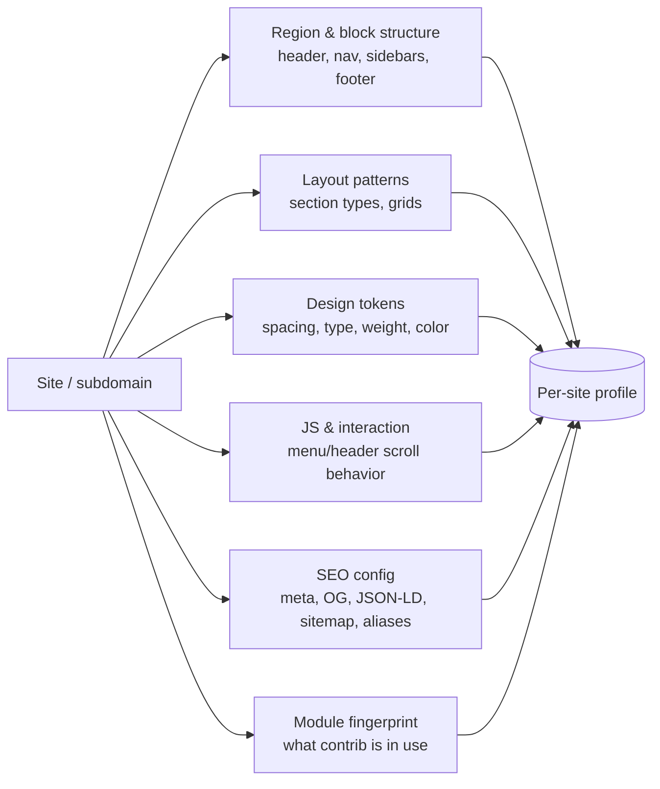
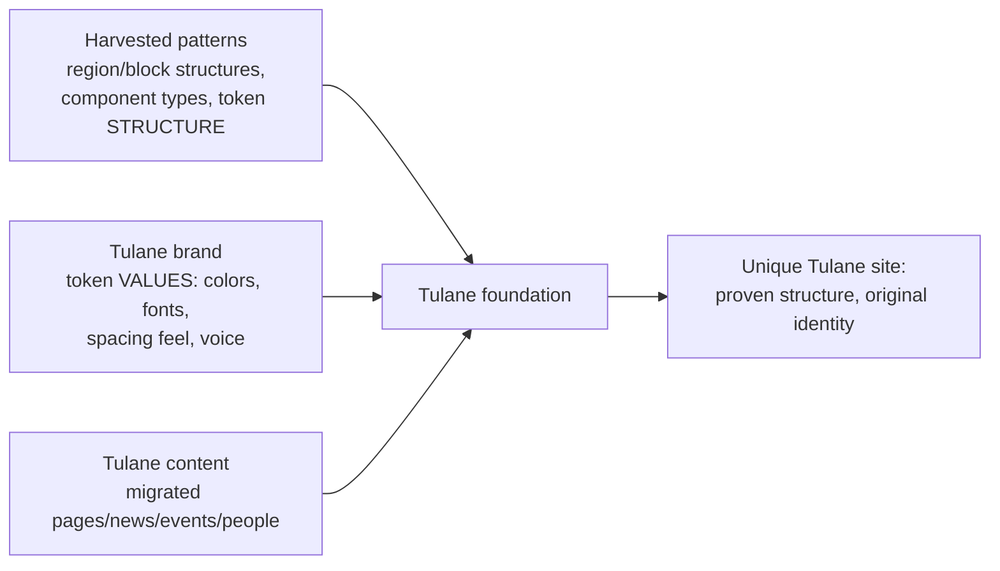

# Design Research — Harvesting Region/Block & Style Patterns to Build a Tulane Brand

## Purpose

Capture the **styles, layouts, region/block structures, components, and modules** used
across many university Drupal sites (and their subdomains) so we have a well-understood
**foundation from which to design a unique Tulane brand** — not to copy any one site, but
to learn the patterns the best higher-ed Drupal sites converge on, then diverge
deliberately.

The emphasis is on **region/block architecture and layout** across lots of subdomains,
plus the design tokens (spacing, type, weight, color) and interaction patterns (menu/header
scroll behavior) that make those layouts feel polished.

---

## Table of Contents

1. [Two research modes: read-source vs. scrape-teardown](#1-two-research-modes)
2. [Primary find: YaleSites is fully open source](#2-primary-find-yalesites-is-fully-open-source)
3. [YaleSites design tokens](#3-yalesites-design-tokens)
4. [YaleSites component inventory](#4-yalesites-component-inventory)
5. [Reference platforms & their editor/governance docs](#5-reference-platforms--their-editorgovernance-docs)
6. [What to capture per site](#6-what-to-capture-per-site)
7. [CDP teardown methodology (non-open-source sites)](#7-cdp-teardown-methodology)
8. [From research to a unique Tulane brand](#8-from-research-to-a-unique-tulane-brand)
9. [Repository structure](#9-repository-structure)
10. [Open questions / decisions](#10-open-questions--decisions)
11. [Sources & links](#11-sources--links)

---

## 1. Two research modes

The approach splits by whether a target's code is public:



- **Read-source** is dramatically higher fidelity (ground-truth tokens and markup) — use it
  wherever the platform is open source.
- **Scrape-teardown** (Chrome DevTools Protocol via a headless browser) recovers computed
  styles and structure from sites whose code we can't see.

---

## 2. Primary find: YaleSites is fully open source

Yale publishes its entire Drupal platform — install profile, theme, component library, and
design tokens — under the [yalesites-org](https://github.com/yalesites-org) GitHub
organization (GPL, same as Drupal core). This is the richest single reference we have for
region/block + component + token patterns.

| Repo | What it is | Value for us |
|------|-----------|-------------|
| `yalesites-project` | Pantheon upstream / Drupal distribution | The platform's **module list** (composer) |
| `atomic` | Drupal **Twig theme** | How components are themed; header/scroll JS |
| `component-library-twig` | **Emulsify** component library + Storybook | Every component's markup + SCSS |
| `tokens` | Design tokens package | Cross-library token source |
| `yale-ui-cl` | Yale UI component library | Additional shared UI |
| `yale_cas` | CAS SSO module | Their auth approach |

**Architecture:** built on **Emulsify** (component-driven Drupal design system),
**Storybook** for browsing components, **SCSS** (not Tailwind), and a **design-token**
system. Accessibility is first-class (Yale authored the **Editoria11y** a11y checker).

**Browse every component live:** https://yalesites-org.github.io/component-library-twig

> Note: YaleSites' upstream tracks **Drupal 10.x**; our Tulane project targets **Drupal 11**.
> Treat YaleSites as a *pattern and token reference*, not a drop-in dependency.

---

## 3. YaleSites design tokens

From `component-library-twig/components/00-tokens/`. These are exactly the values we'd
otherwise try to compute via CDP — here they are at the source. They define the visual
language and are the natural template for a **Tulane token set** (same structure, Tulane
values).

| Token group | Contains | Maps to our wishlist |
|-------------|----------|----------------------|
| `spacing` | margin/padding scale | margin/padding |
| `typography` | font families, sizes, **weights**, line-height | font-weight, type scale |
| `colors` | brand palette | color |
| `breakpoints` | responsive breakpoints | layout responsiveness |
| `layout` | grid/container system | region/grid structure |
| `effects` | shadows, transitions | scroll/animation polish |
| `functions` / `utility` | SCSS helpers | implementation detail |

---

## 4. YaleSites component inventory

The full Emulsify atomic-design library (`components/`). This is the catalog of chips,
cards, menus, and sections a mature higher-ed platform offers editors.

### Atoms (`01-atoms`)
controls · date-time · divider · forms · images · lists · tables · typography · videos

### Molecules (`02-molecules`)
accordion · alert · banner · callout · cards · content-spotlight-portrait · embed ·
facts-and-figures · image · inline-message · link-grid · link-group · link-skip · menu ·
meta · modal · page-title · pager · pull-quote · quick-links · quote-callout · read-time ·
related-content · search-result · social-links · tabs · taxonomy-display · text-with-image ·
text · tile-item · video · wrapped-callout · wrapped-image

### Organisms (`03-organisms`)
block-wrapper · calendar · card-collection · component-wrapper · custom-card-collection ·
facts-and-figures-group · galleries · layout · menu · site-footer · site-header ·
site-in-this-section (secondary/section nav) · tiles

### Page layouts (`04-page-layouts`)
full-width templates · placeholder · page examples

> The **organisms** are where region/block structure lives — `site-header`, `site-footer`,
> `layout`, `menu`, `site-in-this-section`, and the `*-collection` blocks are the
> page-region building blocks to study most closely.

---

## 5. Reference platforms & their editor/governance docs

Three universities publish detailed editor documentation (with screenshots showing every
component and tool) — useful for both the component inventory and the **governance** angle
(how faculty request subsites and manage content/users).

| Platform | Docs URL | Open source? | Notes |
|----------|----------|--------------|-------|
| **YaleSites** (Yale) | https://yalesites.yale.edu/explore-resources/user-guide | ✅ Yes | Emulsify; Editoria11y; site-request forms; editorial workflow |
| **SLAC** (Stanford) | https://drupalguide.slac.stanford.edu/ | ❌ Teardown | Paragraph-type building blocks; webforms; request-a-site flow |
| **Ohio State ETS** | https://ets.osu.edu/drupal-help | ❌ Teardown | ServiceNow-integrated support; role-based access docs |

Each doc site also documents the **operational model** worth cataloging: how a faculty
member requests a Drupal subdomain, and how editors manage content, users, and permissions.

---

## 6. What to capture per site

For every target (and ideally several subdomains per institution, since layouts vary by
subdomain), record:



- **Region/block structure** — the named regions and which blocks land where (the core
  focus: how pages are composed across subdomains).
- **Layout patterns** — section/grid types, one/two/three-column, full-width heroes.
- **Design tokens** — spacing, type scale, font weights, color usage (source or computed).
- **JS & interaction** — especially **menu/header animation on scroll** (sticky, shrink,
  hide-on-down/reveal-on-up; libraries like Headroom.js, GSAP, IntersectionObserver).
- **SEO config** — meta/Open Graph/Twitter tags, JSON-LD schema types, `/sitemap.xml`
  shape, path-alias strategy, robots.txt.
- **Module fingerprint** — contrib modules inferred from asset paths, `drupalSettings`,
  and markup classes.

---

## 7. CDP teardown methodology

For non-open-source targets, drive a real browser (Playwright/Puppeteer over the Chrome
DevTools Protocol). What CDP uniquely unlocks beyond a static scraper:

- **Computed styles** — real margin/padding/font-weight as rendered (the design tokens).
- **Scroll-state capture** — scriptably scroll, snapshot the header's computed
  `position`/`transform`/`height`/`background` and diffed class lists at each offset to
  characterize the animation; read CSS transition timing via the Animation domain.
- **Event listeners & runtime state** — how interactions are wired.
- **Performance traces & screenshots** — visual catalog + Core Web Vitals.

**Drupal module fingerprints (frontend-detectable):**
- Asset URL paths: `/core/...`, `/modules/contrib/<name>/...`, `/themes/custom/<name>/...`,
  `/sites/default/files/...`
- `drupalSettings` JSON (`data-drupal-selector="drupal-settings-json"`) and
  `ajaxPageState.libraries`
- Markup signatures: `.view-id-*` (Views), `.paragraph--type--*` (Paragraphs),
  `.layout-builder`/`.layout__region` (Layout Builder), `webform-submission-form`, etc.
- HTTP headers: `X-Generator`, `X-Drupal-Cache`, `X-Drupal-Dynamic-Cache`, CDN headers

**Guardrails:** respect `robots.txt`, rate-limit politely, fetch only public pages,
identify the crawler. Tag every finding with a **confidence level** (confirmed via asset
path vs. inferred from markup). For Tulane's own site, this is just standard content
migration — no fingerprinting needed.

---

## 8. From research to a unique Tulane brand

The point is divergence, not imitation. The research gives a **structural and token
foundation**; Tulane's brand is then expressed by changing the *values*, not the
architecture.



- **Adopt the *structure*** — which regions/blocks exist, which component types editors
  need, how tokens are organized. This is the convergent wisdom across mature sites.
- **Author original *values*** — Tulane's palette, typography, spacing personality, motion
  style. This is where the unique brand lives.
- **Populate Tulane content** — real data into the matching content types.

---

## 9. Repository structure

Proposed shape for the "huge repository" of harvested patterns:

```
docs/
  design-research.md            # this file (index + methodology)
  research/
    yalesites/                  # read-source: tokens, component notes, module list
    slac-stanford/              # teardown: per-site profile
    ohio-state/                 # teardown: per-site profile
    <other-universities>/
  component-catalog.md          # cross-site component inventory (chips, cards, menus…)
  token-comparison.md           # spacing/type/weight/color across sites
  interaction-patterns.md       # menu/header scroll behaviors
  seo-profiles.md               # per-site SEO posture
  governance-models.md          # how each runs subsites + faculty onboarding
  gap-analysis.md               # Tulane vs peers
```

(Per-site profiles can be markdown + JSON; CDP output stored as JSON for queryability.)

---

## 10. Open questions / decisions

Not yet decided — captured here so the research stays decision-relevant:

- **How to use YaleSites** — design system only (reskin components+tokens on our D11
  backend) · adopt the whole platform · build fresh but Yale-inspired · spike first.
- **Hosting target** — Pantheon (eases adopting Yale's upstream) · Acquia · self-hosted ·
  undecided. (YaleSites' upstream assumes Pantheon.)
- **Breadth vs. depth** — few pages per site deeply analyzed vs. broad crawls; how many
  peer institutions and how many subdomains each.
- **Tooling** — Playwright vs. Puppeteer; Node/Bun + TypeScript for the CDP teardown.
- **Drupal version** — Tulane on D11; YaleSites on D10 (reference only, not a dependency).

See also [architecture-considerations.md](architecture-considerations.md) for the broader
platform/governance/accessibility context.

---

## 11. Sources & links

**YaleSites (open source):**
- Org: https://github.com/yalesites-org
- `yalesites-project` (distribution/upstream): https://github.com/yalesites-org/yalesites-project
- `atomic` (theme): https://github.com/yalesites-org/atomic
- `component-library-twig`: https://github.com/yalesites-org/component-library-twig
- `tokens`: https://github.com/yalesites-org/tokens
- Live Storybook: https://yalesites-org.github.io/component-library-twig
- User guide: https://yalesites.yale.edu/explore-resources/user-guide
- Drupal.org case study: https://new.drupal.org/case-study/yalesites-at-yale-university

**Reference platforms:**
- SLAC Stanford Drupal guide: https://drupalguide.slac.stanford.edu/
- Ohio State ETS Drupal help: https://ets.osu.edu/drupal-help

**Design system underpinning:**
- Emulsify design system: https://www.emulsify.info/
- Editoria11y (Yale a11y checker): https://www.drupal.org/project/editoria11y
