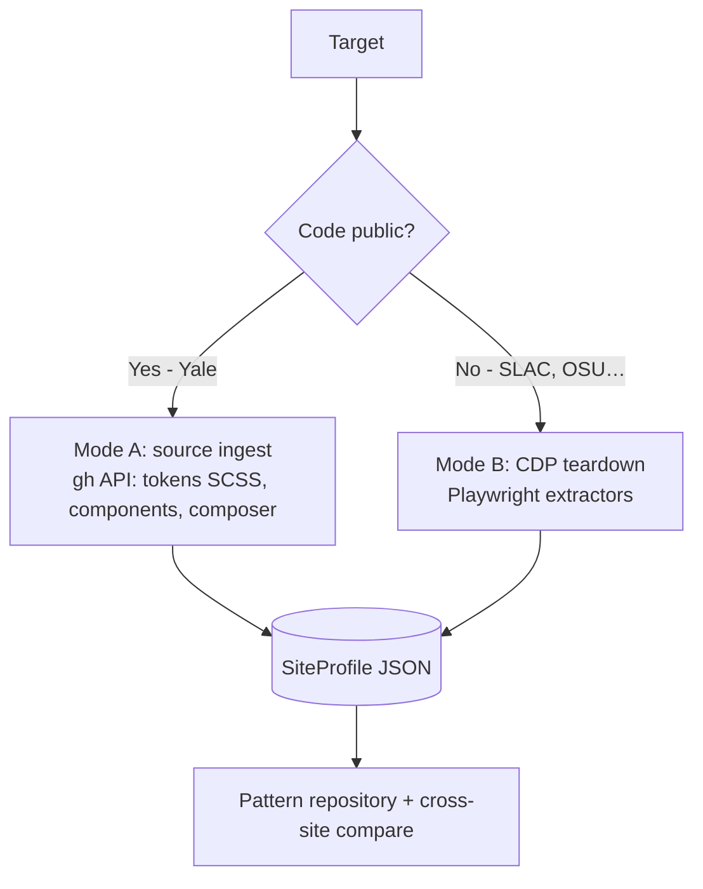
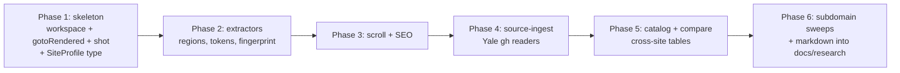

# Harvester Tooling — Playwright/CDP Tools to Profile University Drupal Sites

How we'll build the TypeScript + Playwright tools that capture region/block structure,
design tokens, interaction patterns, SEO posture, and module fingerprints across many
university Drupal sites and subdomains — feeding the pattern repository described in
[design-research.md](design-research.md).

## Conventions inherited from `prairielearn-debug`

This tooling follows the patterns already proven in
`~/Projects/Temp/prairielearn-debug` (the host-side Playwright journey runner that
"captures token-optimized evidence"):

- **TypeScript + ESM**, npm **workspaces** (`packages/*`).
- **Playwright `@playwright/test`** as the driver; scenarios discovered by `scenario*.ts`.
- A reusable dev-tools package of **typed primitives** that return *structured results*
  (e.g. `RenderResult { rendered, status, reason }`) instead of throwing.
- **Render-gating** (`gotoRendered`) — never capture/measure a broken or 500 page and call
  it data.
- **Token-optimized screenshots** (`shot`) — `sharp` downscale to ~1024px wide at low JPEG
  quality, because an image is tokenized by pixel dimensions (~w·h/750), so downscaling is
  the real lever. `sharp` imported lazily with a JPEG fallback.
- **Env-var config** (`*_BASE_URL`, `*_ARTIFACTS_DIR`), **JSON reporter**, explicit capture
  (`screenshot: 'off'` in config), `reference/*.md` for methodology.

We reuse `gotoRendered` and `shot` near-verbatim (adapted to Drupal render heuristics) and
add Drupal-specific extractors on top.

---

## Two ingest modes (same output schema)

A site is profiled one of two ways depending on whether its code is public. Both emit the
**same `SiteProfile`** so everything is comparable.



- **Mode A — source ingest** (highest fidelity): for open-source platforms (YaleSites). A
  small Node script uses `gh` to read the design-token SCSS, the component directory, and
  the `composer.json` module list. No browser needed.
- **Mode B — CDP teardown**: for closed sites. The Playwright harvester below recovers the
  same fields from rendered pages.

---

## Package architecture

A self-contained workspace (own repo or `tools/` beside the Drupal project — kept out of
the Drupal app so it never ships to production):

```
harvester/
  package.json                 # workspaces: packages/*
  playwright.config.ts         # screenshot:off, json reporter, scenario*.ts
  packages/
    harvester/                 # reusable primitives (the dev-tools analogue)
      src/
        gotoRendered.ts        # render-gating, Drupal-aware
        shot.ts                # token-optimized screenshot (sharp, ~1024px)
        regions.ts             # region/block DOM structure
        tokens.ts              # computed design tokens (spacing/type/weight/color)
        scroll.ts              # header/menu scroll-behavior capture
        seo.ts                 # meta/OG/JSON-LD/sitemap/robots/aliases
        fingerprint.ts         # Drupal module detection + confidence
        types.ts               # SiteProfile schema
    source-ingest/             # Mode A: gh-based source readers
      src/
        tokens-scss.ts         # parse SCSS token files
        components.ts          # enumerate component dirs
        modules.ts             # parse composer require
    catalog/                   # storage + comparison
      src/
        store.ts               # write per-site profile + screenshots
        compare.ts             # cross-site token/component/region diffing
  targets/                     # one scenario per university (journeys analogue)
    yale/scenario.ts
    slac-stanford/scenario.ts
    ohio-state/scenario.ts
  reference/                   # methodology notes
  out/                         # generated profiles + token-optimized screenshots
```

---

## Core capture primitives

Each is a typed function returning structured data. Signatures below are the contract.

### `gotoRendered(page, url) → RenderResult`
Adapted from PL's version. Navigates, gates on HTTP status and broken-page heuristics, and
additionally flags whether the page looks like Drupal.
```ts
interface RenderResult {
  rendered: boolean;
  status: number | null;
  reason?: string;
  isDrupal?: boolean;   // generator meta / drupalSettings / core asset paths present
}
```

### `shot(page, label, opts?) → path`
PL's token-optimized screenshot, reused. Downscale to `maxWidth` (default 1024), low JPEG
quality (default ~45), `sharp` lazy with fallback. Used for the **visual component
catalog** — one shot per component/region, cheap for LLM review.

### `extractRegions(page) → RegionTree`
Walks the DOM for Drupal **region/block** structure — the central deliverable.
Signals: HTML landmarks (`header/nav/main/aside/footer`), `.region--*` / `.layout__region`
(Layout Builder), `[data-drupal-selector]`, `.block`, `.block-*`, and theme region classes.
```ts
interface RegionTree {
  regions: Array<{
    name: string;                 // header, sidebar_first, content, footer…
    selector: string;
    blocks: Array<{
      type: string;               // inferred component (card, menu, hero, view…)
      classes: string[];
      componentGuess?: string;    // map to Emulsify-style atom/molecule/organism
      box: { w: number; h: number };
    }>;
  }>;
}
```

### `extractTokens(page) → TokenSet`
Reads `getComputedStyle` across representative elements (body, h1–h6, p, a, button, the
card/menu samples found by `extractRegions`) and **infers the scales** — this is the
"compute margin/padding/font-weight via CDP" goal.
```ts
interface TokenSet {
  spacing: number[];                          // sorted unique margins/paddings (px)
  typography: { family: string[]; sizes: number[]; weights: number[]; lineHeights: number[] };
  colors: { palette: string[]; text: string[]; background: string[] };  // de-duped
  radii: number[];
  shadows: string[];
  samples: Record<string, ComputedSample>;    // per-element raw values for audit
}
```

### `captureScrollBehavior(page) → ScrollProfile`
Scriptably scrolls through offsets; at each, snapshots the header's computed
`position/transform/height/background/boxShadow/backdropFilter` and its `classList`, then
diffs to characterize the pattern. Detects mechanism via listeners/known libs.
```ts
interface ScrollProfile {
  pattern: 'static' | 'sticky' | 'shrink' | 'hide-reveal' | 'mixed';
  states: Array<{ offset: number; position: string; transform: string; height: number; classes: string[] }>;
  transition?: { property: string; durationMs: number; easing: string };
  library?: 'headroom' | 'gsap' | 'scrollmagic' | 'intersection-observer' | 'custom' | null;
}
```

### `extractSeo(page, request) → SeoProfile`
`<head>` meta + Open Graph + Twitter + canonical + robots; all `application/ld+json` blocks
(record schema `@type`s); fetch `/sitemap.xml` (URL count, structure, `hreflang`) and
`/robots.txt`; sample link hrefs for path-alias strategy.

### `fingerprintModules(page, response) → ModuleFingerprint`
Drupal module detection with **confidence tagging** (per design-research.md guardrail):
- asset paths `/modules/contrib/<name>/`, `/themes/custom/<name>/`, `/core/…` (→ confirmed)
- `drupalSettings` + `ajaxPageState.libraries` (→ confirmed/likely)
- markup signatures: `.view-id-*`, `.paragraph--type--*`, `.layout-builder`,
  `webform-submission-form`, `<picture>`+`/files/styles/` (→ inferred)
- HTTP headers: `X-Generator`, `X-Drupal-Cache`, `X-Drupal-Dynamic-Cache`, CDN headers
```ts
interface ModuleFingerprint {
  drupalCore?: string;
  hosting?: string;                                   // Pantheon/Acquia/Fastly…
  modules: Array<{ name: string; confidence: 'confirmed' | 'likely' | 'inferred'; evidence: string }>;
  theme?: string;
}
```

### `detectServices(page, response) → ServiceInventory`
Detects **third-party services** wired into the page — beyond the Drupal stack. Google
Analytics is assumed (a given) and not worth flagging; the interesting signals are
everything else. Sources: external `<script>`/`<link>` src domains, markup classes/data
attributes, cookies, iframes, and HTTP headers.
```ts
interface ServiceInventory {
  services: Array<{
    category: string;                                 // captcha, search, video, consent…
    name: string;                                     // "Cloudflare Turnstile", "Funnelback"
    confidence: 'confirmed' | 'likely' | 'inferred';
    evidence: string;                                 // the matched domain/class/header
  }>;
}
```
The signature catalog it matches against lives in
[§ Third-party service signatures](#third-party-service-signatures).

---

## The `SiteProfile` output

The unified record both modes produce, one per site/subdomain:
```ts
interface SiteProfile {
  site: string;                 // e.g. "yale.edu" or "law.yale.edu"
  url: string;
  capturedAt: string;           // stamped after run (Date unavailable mid-script)
  mode: 'source' | 'cdp';
  regions: RegionTree;
  tokens: TokenSet;
  scroll: ScrollProfile;
  seo: SeoProfile;
  fingerprint: ModuleFingerprint;
  services: ServiceInventory;   // third-party services (Turnstile, Funnelback, Kaltura…)
  screenshots: string[];        // token-optimized image paths
}
```

Stored by `catalog/store.ts` under `out/<site>/profile.json` + screenshots, and surfaced as
markdown under `docs/research/<site>/` per the repository structure.

---

## Per-target scenario (the `journeys/` analogue)

Each university is a scenario that profiles its homepage **and a set of subdomains** (since
region/block layouts vary across subdomains — your main interest):

```ts
// targets/yale/scenario.ts
import { test } from '@playwright/test';
import { gotoRendered, shot, extractRegions, extractTokens, captureScrollBehavior,
         extractSeo, fingerprintModules, detectServices } from '@harvest/harvester';
import { writeProfile } from '@harvest/catalog/store';

const SUBDOMAINS = ['https://www.yale.edu', 'https://law.yale.edu', 'https://som.yale.edu'];

for (const url of SUBDOMAINS) {
  test(`profile ${url}`, async ({ page, context, request }) => {
    const r = await gotoRendered(page, url);
    test.skip(!r.rendered, `unrendered: ${r.reason}`);
    const profile = {
      site: new URL(url).hostname, url, mode: 'cdp' as const,
      regions: await extractRegions(page),
      tokens: await extractTokens(page),
      scroll: await captureScrollBehavior(page),
      seo: await extractSeo(page, request),
      fingerprint: await fingerprintModules(page, r),
      services: await detectServices(page, r),
      screenshots: [await shot(page, 'home')],
    };
    await writeProfile(profile);
  });
}
```

---

## Token-optimized evidence

Following PL's philosophy that artifacts are for LLM consumption:
- **Screenshots** downscaled to ~1024px / low quality via `shot` (one per region/component,
  not full-page dumps).
- **Profiles are JSON** — queryable, diffable, cheap to feed back into analysis.
- **Cross-site comparison** (`catalog/compare.ts`) emits compact markdown tables (token
  scales side by side, component coverage matrix, region-structure diffs) rather than raw
  dumps.

---

## Third-party service signatures

The catalog `detectServices` matches against. Higher-ed sites lean on a recognizable set;
**★ = especially common on university sites.** Google Analytics / GTM are assumed and not
flagged. Each row lists the detection signal (JS/asset domain, markup class/attribute,
cookie, or HTTP header).

### Bot protection / CAPTCHA
- **Cloudflare Turnstile** ★ — `challenges.cloudflare.com/turnstile`, `.cf-turnstile`
- **Google reCAPTCHA** — `www.google.com/recaptcha`, `.g-recaptcha`, `grecaptcha`
- **hCaptcha** — `hcaptcha.com`, `.h-captcha`

### Site search
- **Funnelback / Squiz** ★ — `funnelback`, `squiz` (very common in higher ed)
- **Google Programmable Search (CSE)** — `cse.google.com`, `gcse`
- **Algolia** — `algolia`, `algolianet.com`, `docsearch`
- **Yext** — `yext`, search/answers widgets
- **Swiftype / Elastic Site Search** — `swiftype`, `s.swiftypecdn.com`
- **Acquia Search / Solr** — backend (inferred from Acquia hosting)

### Video / media
- **Kaltura** ★ — `kaltura.com`, `cdnapisec.kaltura` (lecture capture; ubiquitous in edu)
- **Brightcove** ★ — `players.brightcove.net`
- **YouTube** — `youtube.com/embed`, `youtube-nocookie.com`
- **Vimeo** — `player.vimeo.com`
- **Wistia / JW Player** — `wistia`, `jwplayer`

### Events / calendars
- **Localist** ★ — `localist.com`, `localistapp` (higher-ed events platform)
- **25Live / CollegeNET** — `25live`, `collegenet`
- **Trumba** — `trumba.com`

### Surveys / forms
- **Qualtrics** ★ — `qualtrics.com`, `.qualtrics-` (dominant survey tool in edu)
- **Formstack / Wufoo / JotForm** — `formstack`, `wufoo`, `jotform`
- **FormAssembly** — `tfaforms.com`

### CRM / marketing / personalization
- **Slate (Technolutions)** ★ — `technolutions`, `slate` (admissions CRM)
- **Salesforce Pardot / Marketing Cloud** — `pi.pardot.com`, `pardot`, `exct` cookies
- **HubSpot** — `js.hs-scripts.com`, `hs-analytics`
- **Acquia Lift / Adobe Target** — `lift.acquia`, `tt.omtrdc.net`
- **Eloqua** — `eloqua`, `en.marketing`

### Consent / privacy
- **OneTrust** ★ — `cdn.cookielaw.org`, `onetrust`, `OptanonConsent` cookie
- **Cookiebot** — `consent.cookiebot.com`
- **Osano / TrustArc / Usercentrics** — `osano`, `trustarc`, `usercentrics`

### Tag / consent management
- **Tealium** — `tags.tiqcdn.com`, `utag`
- **Ensighten** — `ensighten`

### Fonts / type
- **Adobe Fonts (Typekit)** ★ — `use.typekit.net`, `p.typekit.net`
- **Google Fonts** — `fonts.googleapis.com`
- **Font Awesome** — `kit.fontawesome.com`, `use.fontawesome.com`

### Maps
- **Google Maps** — `maps.googleapis.com`
- **Mapbox** — `api.mapbox.com`, `mapbox-gl`
- **Leaflet** — `leaflet`

### Accessibility
- **Siteimprove** ★ — `siteimprove`, `siteimproveanalytics.com` (a11y + analytics; huge in edu)
- **Editoria11y** ★ — `editoria11y` (Yale-authored Drupal a11y checker)
- **UserWay / AudioEye / accessiBe** — `userway`, `audioeye`, `accessibe` (overlays)

### Analytics / monitoring (beyond GA)
- **Adobe Analytics (Omniture)** — `sc.omtrdc.net`, `s_code`, `AppMeasurement`
- **Siteimprove Analytics** — (see above)
- **Matomo / Plausible / Fathom** — `matomo`, `plausible.io`, `usefathom.com`
- **Hotjar / Crazy Egg** — `hotjar`, `crazyegg` (heatmaps)
- **New Relic / Datadog RUM** — `nr-data.net`, `datadoghq` (performance)

### Chat / support
- **ServiceNow** ★ — `service-now.com` (Ohio State uses this)
- **Ivy.ai / chatbots** — `ivy.ai`, custom AOAI bots (e.g. Yale's askyale)
- **Intercom / Drift / Zendesk / LiveChat** — `intercom`, `drift`, `zendesk`, `livechat`

### Hosting / CDN / WAF (mostly from headers)
- **Pantheon** ★ — `x-pantheon-*`, `styx` (YaleSites' platform)
- **Acquia** ★ — `x-ah-*`, `x-acquia` headers
- **Cloudflare** — `cf-ray`, `__cf_bm` cookie, `challenges.cloudflare.com`
- **Fastly** — `x-served-by`, `x-fastly-*`
- **Akamai** — `akamai`, `x-akamai-*`
- **AWS CloudFront / S3** — `x-amz-cf-id`, `*.cloudfront.net`, `*.s3.amazonaws.com`

### Giving / advancement
- **Blackbaud / GiveCampus / Classy / iModules (Anthology)** — `blackbaud`, `givecampus`,
  `classy.org`, `imodules` (donation/alumni platforms)

> Each detection is tagged with confidence: a loaded script from the vendor's domain is
> **confirmed**; a cookie or class name alone is **likely**; an indirect hint is
> **inferred**. The catalog is data-driven (a signature list), so adding a service is one
> entry, not new code.

## Guardrails (built into the primitives)

- **`robots.txt` respected** — `extractSeo` fetches it; the runner skips disallowed paths.
- **Rate-limited & low concurrency** — `fullyParallel: false`, polite delays between sites.
- **Public pages only**, identifying User-Agent.
- **Confidence tagging** on every inferred module/finding.
- **Tulane's own site** is exempt from teardown framing — that's straightforward content
  migration, not fingerprinting.

---

## Build phases



1. **Skeleton** — workspace, config, port `gotoRendered`/`shot`, define `SiteProfile`. Prove
   end-to-end on one Yale page.
2. **Core extractors** — `extractRegions`, `extractTokens`, `fingerprintModules` (the
   region/block + token + module core).
3. **Interaction + SEO** — `captureScrollBehavior`, `extractSeo`.
4. **Source ingest** — Mode A `gh` readers for YaleSites (definitive tokens + module list).
5. **Catalog + compare** — storage and cross-site comparison tables.
6. **Sweeps** — run across subdomains and multiple universities; render markdown into
   `docs/research/`.

---

## How this feeds the brand foundation

Each profile contributes structure and tokens to the repository; the cross-site comparison
reveals what mature higher-ed Drupal sites converge on (region/block patterns, component
sets, token scales, scroll polish, SEO posture). That convergent foundation is what we then
**diverge from deliberately** to author a unique Tulane brand — adopting proven *structure*,
authoring original *values* (see [design-research.md §8](design-research.md#8-from-research-to-a-unique-tulane-brand)).

## Reference

- Source patterns: `~/Projects/Temp/prairielearn-debug` (`packages/dev-tools/src/journey.ts`,
  `playwright.config.ts`, `journeys/debug/scenario.ts`)
- [design-research.md](design-research.md) — what we're harvesting and why
- [architecture-considerations.md](architecture-considerations.md) — broader build context
