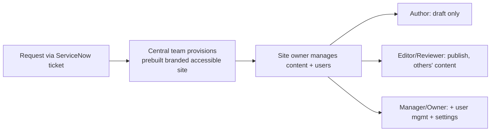

# Governance Models — Site Requests, Roles & Content Management

How peer universities run their Drupal platforms operationally: how faculty/staff **request
a site/subdomain**, the **user roles**, and how **content and users are managed**. Distilled
from the published editor documentation of SLAC (Stanford), Ohio State (ETS), and YaleSites.

## The convergent pattern

Despite different campuses, the operating model is strikingly consistent:

1. **Request via an IT ticket** (ServiceNow), get a **prebuilt, brand-compliant, accessible
   site** in days — site owners never start from a blank Drupal.
2. **A three-tier role model**: Author → Editor/Reviewer → Manager/Owner.
3. **Central IT owns infrastructure** (hosting, backups, security, updates, theme/brand);
   **departments own content** within guardrails. (Hybrid governance, as predicted in
   `architecture-considerations.md §8`.)

## Site-request process

### SLAC (Stanford)
- **System:** ServiceNow portal — a "Request Drupal site" catalog item.
- **Eligibility:** requester must have a full SLAC ID.
- **Turnaround:** ~**5 business days**.
- **Delivered:** site arrives with prebuilt pages, accessible + mobile-responsive layout,
  Google Analytics, and SLAC branding already applied.
- **Pre-request guidance:** audit existing content and justify the need first (anti-sprawl
  governance).

### Ohio State (ETS)
- Access/site obtained via ETS (Virtual Helpdesk / phone / walk-in); users added per-site by
  the Site Manager.

### YaleSites
- **Site Request Forms** at `/request`; support via office hours, training catalog, and
  `yalesites@yale.edu`. A **Go-Live Checklist** gates launch ("guardian against common
  pitfalls" — accessibility + branding implied).

> Note: **ServiceNow as the request mechanism** matches the fingerprint sweep — ServiceNow
> was detected on Stanford and Ohio State sites. The IT-ticket → provisioned-site flow is
> the norm.

## User roles & permissions

A near-identical **three-tier** model recurs (names vary):

| Tier | SLAC (Stanford) | Ohio State | Capabilities |
|------|-----------------|------------|--------------|
| **Author** | Content Author | Content Author | Create/edit **own** content; **cannot publish**; manage own files/media. (OSU: edits only content explicitly granted via access control.) |
| **Editor/Reviewer** | Content Editor | Content Reviewer | Create, **publish**, delete content incl. **others'**; manage taxonomy, menus, web forms. |
| **Manager/Owner** | Site Manager | Site Manager | All of the above **+ manage users/roles**, site settings, site-wide alerts, URL aliases/redirects, view reports. |

Common threads:
- **Publish is the key privilege boundary** — Authors draft, Editors publish. This *is* a
  lightweight editorial workflow even without a formal moderation state machine.
- **Only the top tier manages people** — adding/removing users and assigning roles is a
  Site Manager/Owner power.
- YaleSites exposes the same surface via the top toolbar categories: **Content, Settings,
  People, Reports.**

## Managing users

### Ohio State — explicit flow
1. **People** → **Add user**.
2. Provide the person's **OSU email account**.
3. Assign a **role** → **Create**.
4. **Change role:** Edit → choose new role.
5. **Offboard:** Edit the user → set status **Blocked** → Save.

### SLAC — group-based
- Permissions managed through **Grouper** (Stanford's institutional group-management
  system), so **site owners self-serve** user access rather than filing web-team tickets.
- Off-site access requires **VPN**.

## Content management responsibilities

Site owners inherit ongoing duties (stated explicitly by SLAC and OSU):
- Keep content **updated and relevant** (anti-stale-content governance).
- Keep content **secure and digitally accessible** (WCAG alignment — ties to the
  ADA Title II deadline in `architecture-considerations.md §9`).
- Align content with institutional mission/brand.

Central IT retains: hosting, backups, monitoring, security patching, and the
theme/brand/platform.

## Policies (Ohio State examples)
- Policy for Drupal Web Service **File Storage**
- Policy for **System Asset Administration**
- **Accessibility Assessment** Overview
- Website and Application Development Guide

## Implications for Tulane

1. **Provide a request → provisioned-site pipeline** (a ServiceNow/ticket item that triggers
   a **Recipe**-provisioned, brand-compliant, accessible starter site — ties directly to the
   recipes work: this is exactly the "`department_site` recipe" use case).
2. **Adopt the three-tier role model** (Author / Editor / Manager) — it's the proven
   higher-ed standard; publish is the boundary; only Managers manage people.
3. **Deliver sites pre-branded and accessible**, not blank — governance by default.
4. **Set content-lifecycle expectations** (currency, accessibility, security) on owners,
   with central IT owning platform/brand. Hybrid model confirmed across all three peers.

## Sources
- SLAC roles: https://drupalguide.slac.stanford.edu/get-started/managing-access
- SLAC request: https://drupalguide.slac.stanford.edu/get-started/how-do-i-request-new-site
- Ohio State roles: https://ets.osu.edu/managing-people-drupal-site-roles
- YaleSites user guide: https://yalesites.yale.edu/explore-resources/user-guide
